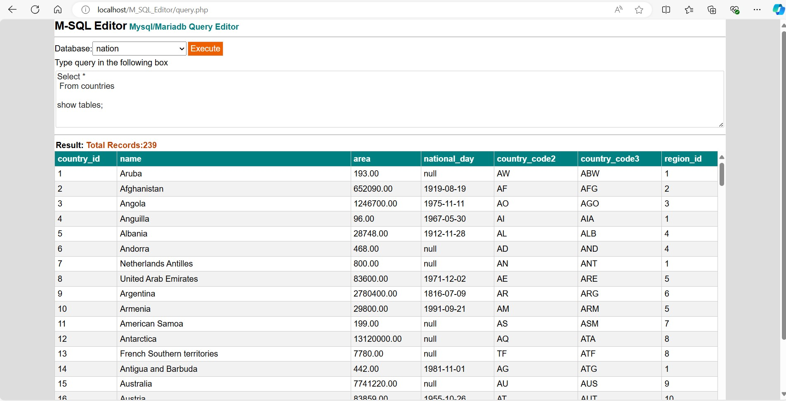

# Simple SQL Editor

A lightweight MySQL/MariaDB SQL editor written in PHP. This web application provides a basic interface to interact with your MySQL/MariaDB databases.

## Disclaimer

**This tool is intended for educational purposes and should not be used with live databases.** Use it only with test or development databases to avoid any potential data loss or security issues.

## Features

- Connect to a MySQL/MariaDB database
- Execute SQL queries
- View query results in a simple table format
- Basic error handling
